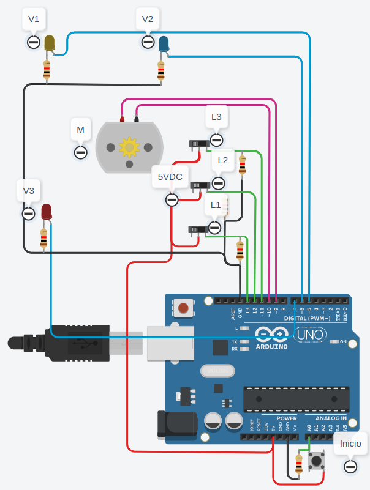
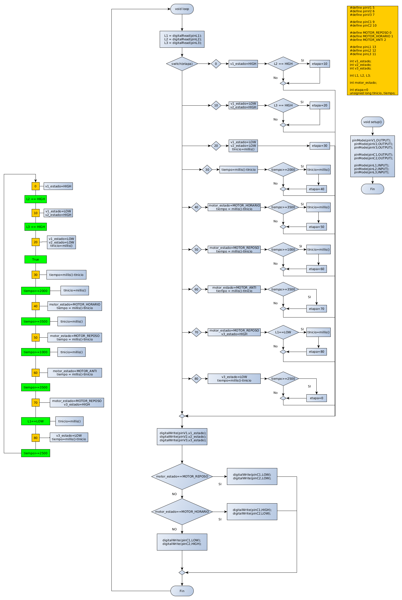

# ARDUINO - CONTROL DE TANQUE MEZCLADOR

A continuación se muestra el esquema general del tanque a controlar. 

Especificaciones generales

* T1. Tanque con capacidad para 200 Litros. 

* L1. Sensor on/off. Se asume de lógica directa, está en HIGH cuando detecta líquido. 

* L2. Sensor on/off. Se asume de lógica directa, está en HIGH cuando detecta líquido. 

* L3. Sensor on/off. Se asume de lógica directa, está en HIGH cuando detecta líquido. 

* V1. Válvula de paso para el líquido 1. Se asume de lógica directa, deja pasar líquido cuando la señal de control está en HIGH. 

* V2. Válvula de paso para el líquido 2. Se asume de lógica directa, deja pasar líquido cuando la señal de control está en HIGH. 

* V3. Válvula de paso de líquido a la salida de T1. Se asume de lógica directa, deja pasar líquido cuando la señal de control está en HIGH. 

* MA. Motor de agitación. Es un motor de DC con posibilidad de reversión de giro. Tiene dos contactos, C1 y C2. Si C1==HIGH y C2==LOW, gira en sentido horario. Si C1==LOW y C2==HIGH, gira en sentido antihorario. Si C1==C2, permanece en reposo. 

El proceso de mezcla es el siguiente. 

* Cuando la máquina enciende, se inicia a llenar con el líquido 1.  

* Cuando el líquido 1 alcanza la mitad del tanque, se deja de verter líquido 1 y se inicia llenado de líquido 2.  

* Cuando el tanque se llena, se deja de verter el líquido 2 y se hace una espera de 2 segundos. 

* Cuando termina la espera, el agitador se enciende 3.5 segundos en sentido horario, se detiene 1 segundo, y luego 3.5 segundos en sentido antihorario. 

* Terminado el paso de agitación, se procede a vaciar el tanque en su totalidad.  

* Terminado el vaciado del tanque, se hace una espera de 2.5 segundos y se inicia un nuevo proceso.  

CIRCUITO IMPLEMENTADO

ESQUEMA SOLUCIÓN

